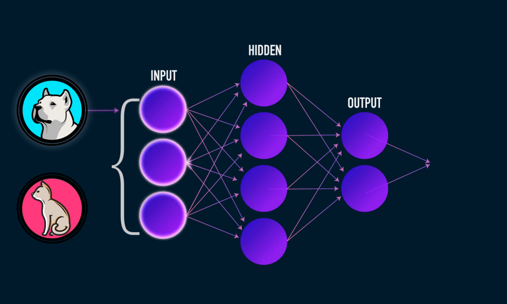

## Hi there 👋

<h1 align="center">Hi 👋, I'm Rishikesh Yadav</h1>
<h3 align="center">A Data Science and Machine Learning Enthu undergrad!</h3>

  

  

  

- 🔭 I’m currently working on **Machine learning**

- 🌱 I’m currently learning **Algorithms, DSA, Data Analytics**

- 👨‍💻 All of my projects are available at [https://github.com/PSYCHOCHARLIE](https://github.com/PSYCHOCHARLIE)

- 💬 Ask me about **Python, C++**

- 📫 How to reach me **rishi2003.dk@gmail.com**

- 📄 Know about my experiences [https://www.canva.com/design/DAGG3YtGne0/xxpKF4E-ciRh8UYg6sT2fg/view?utm_content=DAGG3YtGne0&utm_campaign=designshare&utm_medium=link2&utm_source=uniquelinks&utlId=h19b8c6fdc7](https://www.canva.com/design/DAGG3YtGne0/xxpKF4E-ciRh8UYg6sT2fg/view?utm_content=DAGG3YtGne0&utm_campaign=designshare&utm_medium=link2&utm_source=uniquelinks&utlId=h19b8c6fdc7)

- ⚡ Fun fact **Not taking my work seriously.**

<h3 align="left">Connect with me:</h3>

<h3 align="left">Languages and Tools:</h3>

                  

&nbsp;

